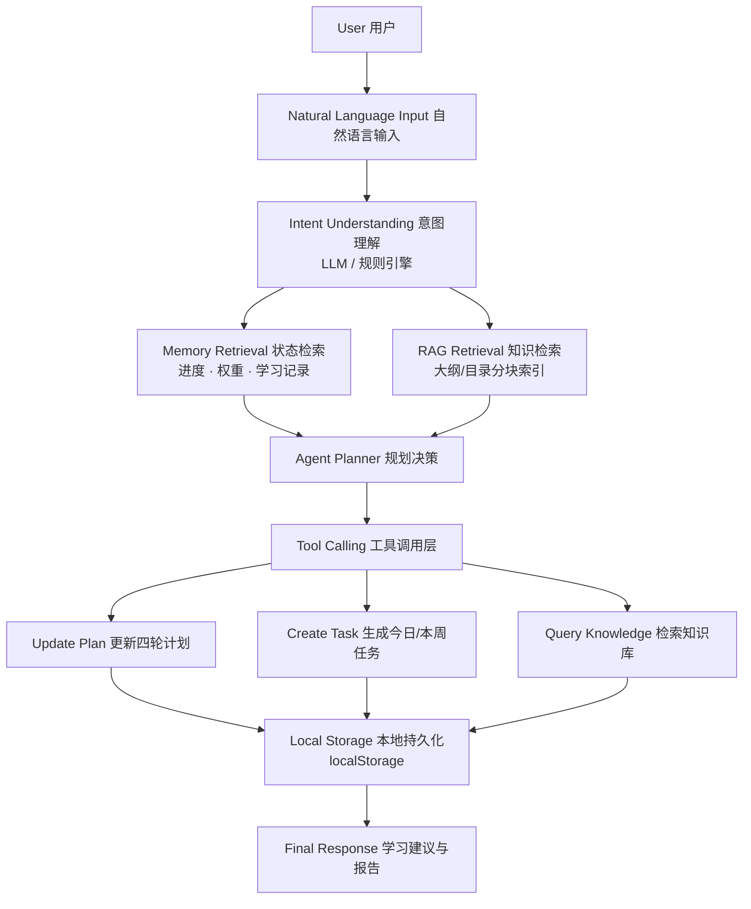
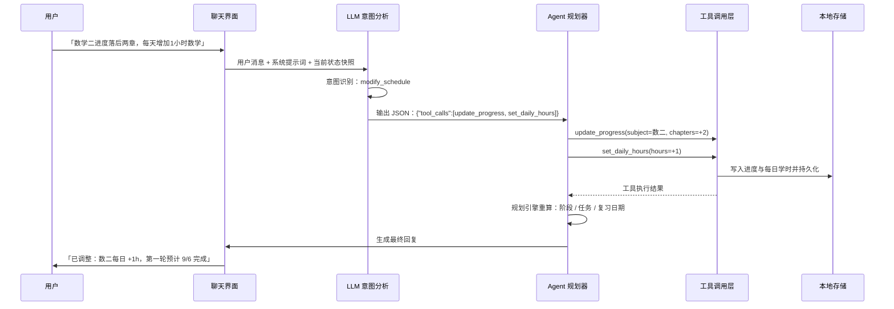

# 🎓 考研学习规划 Agent

一个 AI Agent 驱动的交互式考研学习规划网页应用。单文件、纯前端、开箱即用，也是我的 AI Agent 简历作品项目。

**在线演示：<https://l-umos.github.io/kaoyan-agent/>**


## ✨ 功能特性

- 🤖 **真实 LLM + 工具调用**：在页面填入自己的 API Key（支持 DeepSeek / OpenAI / Kimi / 通义等 OpenAI 兼容接口），对话由真实大模型驱动——分析问题 → 调用规划函数 → 更新计划 → 生成建议，Agent 工作台全程可见
- 📚 **知识库（RAG）**：上传考研大纲、专业课目录（.txt / .md / .json / .csv 或直接粘贴），问"408 网络这章重点是什么"时自动检索资料作答并标注来源
- 🎛️ **科目自选**：政治必考；英语可选英一 / 英二；数学可选数一 / 数二 / 数三 / 不考；专业课 408 可开可关
- 🗺️ **分阶段规划**：基础 → 强化 → 真题 → 冲刺四轮制，自动推算每轮起止日期、各科学时分配和考前可完成轮数
- 🔁 **艾宾浩斯复习**：单词按 1 / 3 / 7 / 15 / 30 天节点滚动复习，章节按 1 / 3 / 7 天复盘
- ✅ **任务管理**：自动生成今日 / 本周任务，支持打卡、修改、新建、删除、归档
- ⏱️ **计时器浮窗**：正计时 / 倒计时 / 番茄钟，可关联科目，结果自动写入统计
- 🎯 **闯关自测**：7 个科目题库，难度自适应，实时打分与评级
- 📊 **统计与总结**：学习热力图（可点击）、学时分布、AI 生成每日 / 整体总结

## System Architecture



### 模块说明

| 模块 | 职责 | 技术点 |
| --- | --- | --- |
| 意图理解 | 把自然语言转成可执行动作 | 配置 LLM 时走真实模型，未配置时回退内置规则引擎 |
| Agent 规划器 | 决策"要不要改状态、怎么改" | LLM 输出 JSON 工具调用协议，应用侧执行并回传结果 |
| 工具调用层 | 更新进度 / 设置优先级 / 调整每日学时 / 重排计划 / 检索知识库 | 6 个可调用工具，参数校验 + 状态变更 + 自动重排 |
| 规划引擎 | 计算四轮学时、轮次日期、今日任务、艾宾浩斯复习 | 权重分配模型 + 时间预算模型 |
| RAG 检索 | 从上传资料中召回相关片段 | 分块 + 中文 bigram 倒排索引 + 标题加权 |
| 持久化 | 保存进度、任务、学习记录、知识库 | 浏览器 localStorage，零后端 |

## Agent Workflow

一次典型请求的完整流程（以"数学二进度落后两章，每天增加 1 小时数学"为例）：



## 🚀 快速开始

1. 下载 `index.html`，用 Chrome / Edge 双击打开
2. 选择考试科目，填写当前进度，开始使用
3. （可选）「🔑 LLM 设置」填入 API Key，解锁真实 LLM 对话与知识库问答

无需安装、无需后端服务器。未配置 LLM 时自动使用内置规则引擎。

## 🗂️ 项目结构

```
kaoyan-agent/
└── index.html   # 完整应用（约 120KB，单文件，含全部功能与知识库）
```

## 📌 使用说明

- 数据保存在浏览器本地（localStorage），API Key 同样只存在本浏览器
- 内置科目结构：政治 13 章、英一 / 英二各 11 章、数一 22 章、数二 13 章、数三 20 章、408 共 26 章
- 页面右上角「重置」可一键清空所有本地数据

## 🔮 后续规划

- LLM 动态出题、自然语言自由问答
- 支持自定义科目与章节结构
- 导出学习报告（PDF / Markdown）

---

作者 [@l-umos](https://github.com/l-umos) · 简历作品项目
